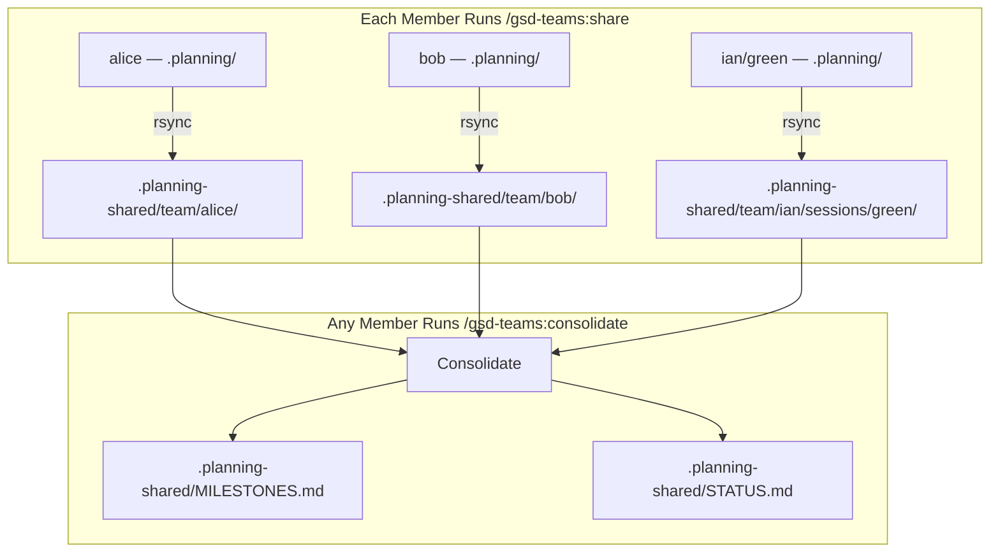

# gsd-teams

Add multi-developer and multi-session support to [GSD](https://github.com/glittercowboy/get-shit-done). Share planning documents across team members and parallel sessions, then consolidate milestones and status into unified views.

<p align="center">
  
</p>

## What It Does

GSD is an amazing workflow! But is has no first-class support for multi-member workflows (development in teams), or multi-session workflows (single developer working on multiple parallel workstreams, i.e. using git worktrees). `gsd-teams` is a Claude Code plugin that extends GSD with multi-member and multi-session coordination. 

As needed, each team member runs the `/gsd-teams:share` to sync `.planning/` files to a member directory `.planning-shared/team`. On milestone completion, a team member of CI should run the `/gsd-teams:consolidate` command to aggregate milestones and status across the entire team. In practice, the plugin is just a few convenience commands to establish a pattern for sharing and consolidating planning documents.

This enables distributed teams (or solo developers with parallel sessions) to share project details and milestones without creating conflicts in the `.planning` directory, which remains uncommitted in the local project.

### Key Concepts

- `.planning` is never committed to git. It is GSD's local working directory.
- `.planning-shared` is always committed to git. Developers decide if they want to share all project files, or just the summaries (`MILESTONES.md`, etc.)

## Prerequisites

- [GSD](https://github.com/glittercowboy/get-shit-done) must be installed and initialized
- Run `/gsd:new-project` in your repo to set up `.planning/` before using gsd-teams

## Installation

Within Claude Code:

```
/plugin marketplace add ianwsperber/gsd-teams
/plugin install gsd-teams@gsd-teams
```

## Commands

| Command | Flags | Description |
|---------|-------|-------------|
| `/gsd-teams:init` | `--name member-name` `--sync full\|shallow` | Set up team configuration (member name, sync mode) |
| `/gsd-teams:share` | `--name member-name` `--shallow` | Share planning state to team directory |
| `/gsd-teams:consolidate` | — | Generate consolidated milestones and status |

### Typical workflow

```bash
# First time: configure your team identity
/gsd-teams:init

# After completing work: share your state
/gsd-teams:share

# To see team-wide progress: consolidate
/gsd-teams:consolidate
```

## How It Works



### Share

`/gsd-teams:share` syncs your `.planning/` directory to `.planning-shared/team/{member}/` using rsync. Each member owns their subdirectory exclusively. Each share also:

- Appends an audit entry to **`.planning-shared/CHANGELOG.md`**
- Commits to git

**CHANGELOG.md** — appended by each `/gsd-teams:share` call:

```
[2026-02-06] alice: v2 Phase 10 (Selective Sync & Team Config)
[2026-02-05] bob: v1 Phase 5 (Documentation)
[2026-02-05] ian (green): v2 Phase 9 (Parallel Session Support)
```

### Consolidate

`/gsd-teams:consolidate` reads **all** member directories in a single run, spawns reporter agents in parallel to extract milestones and status, then generates:

- **`.planning-shared/MILESTONES.md`** — completed milestones across the team, ordered by date
- **`.planning-shared/STATUS.md`** — current work in progress per member/session

### Generated files

**MILESTONES.md** — generated by `/gsd-teams:consolidate`:

```markdown
# Team Milestones

*Consolidated from 3 member/session entries on 2026-02-06 14:30*

## v1: Reusable OpenTofu Workflows (bob)

**Shipped:** 2026-02-02

**Delivered:** Secure, reusable GitHub Actions workflows for OpenTofu.

---

## v2: Team Sharing (alice)

**Shipped:** 2026-02-06

**Delivered:** Cross-session team coordination with shared planning state.
```

**STATUS.md** — generated by `/gsd-teams:consolidate`:

```markdown
# Team Status

*Consolidated from 3 member/session entries on 2026-02-06 14:30*

| Member     | Current Work                          | Last Shared |
|------------|---------------------------------------|-------------|
| alice      | Phase 10 (Selective Sync) - Complete  | 2026-02-06  |
| bob        | Phase 5 (Documentation) - Complete    | 2026-02-05  |
| ian/blue   | Phase 11 (Extension), Plan 2/3        | 2026-02-06  |
| ian/green  | Phase 9 (Parallel Sessions), Plan 3/5 | 2026-02-05  |
```

### Directory structure

All shared state lives under `.planning-shared/` in your repo:

```
.planning-shared/
├── CHANGELOG.md                          # Audit log (appended by share)
├── MILESTONES.md                         # Consolidated milestones (generated by consolidate)
├── STATUS.md                             # Consolidated status (generated by consolidate)
├── last_consolidated.json                # Version tracking for incremental extraction
└── team/
    ├── alice/                            # Flat member directory
    │   ├── STATE.md
    │   ├── ROADMAP.md
    │   └── ...
    ├── bob/
    │   └── ...
    └── ian/
        └── sessions/
            └── green/                    # Session directory (slash notation)
                ├── STATE.md
                └── ...
```

## Configuration

Team settings live in `.planning/config.json` under the `team` key:

```json
{
  "team": {
    "member": "alice",
    "sync": "full",
    "max_session_age_days": 1
  }
}
```

| Setting | Description | Default |
|---------|-------------|---------|
| `member` | Your team identity (e.g., `alice` or `ian/green`) | -- |
| `sync` | Sync mode: `full` (all planning files) or `shallow` (summaries only) | `full` |
| `max_session_age_days` | Auto-clean session directories older than N days | `1` |

Run `/gsd-teams:init` to configure these interactively.

## Parallel Sessions

Use slash notation to create session directories for parallel work:

```
member: ian/green
```

This creates the directory structure `.planning-shared/team/ian/sessions/green/` and tracks each session independently in consolidated output.

## License

[MIT](LICENSE)

---

<sub>Logo adapted from the [GSD](https://github.com/glittercowboy/get-shit-done) project logo using Google Gemini.</sub>
