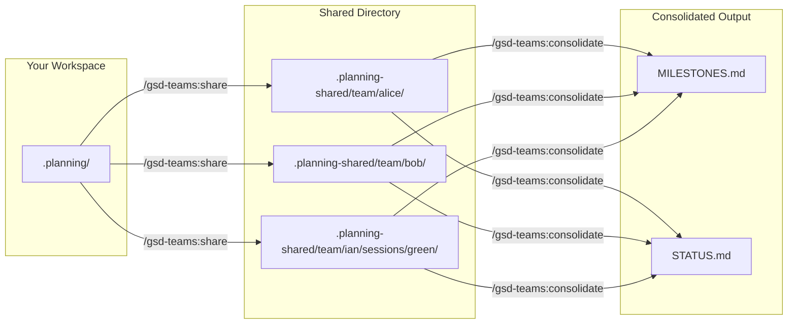

# gsd-teams

Team coordination for [GSD](https://github.com/glittercowboy/get-shit-done) planning state. Share progress across team members and parallel sessions, then consolidate milestones and status into unified views.

## What It Does

gsd-teams extends GSD with multi-member and multi-session coordination. Each team member shares their `.planning/` state to a shared directory, and a consolidation command aggregates milestones and status across the entire team. This enables distributed teams (or solo developers with parallel sessions) to stay aligned without manual status meetings.

## Prerequisites

- [GSD](https://github.com/glittercowboy/get-shit-done) must be installed and initialized
- Run `/gsd:new-project` in your repo to set up `.planning/` before using gsd-teams

## Installation

```
/plugin marketplace add ianwsperber/gsd-teams
/plugin install gsd-teams@gsd-teams
```

## Commands

| Command | Description |
|---------|-------------|
| `/gsd-teams:init` | Set up team configuration (member name, sync mode) |
| `/gsd-teams:share` | Share planning state to team directory |
| `/gsd-teams:consolidate` | Generate consolidated milestones and status |

### Typical workflow

```bash
# First time: configure your team identity
/gsd-teams:init

# After completing work: share your state
/gsd-teams:share

# To see team-wide progress: consolidate
/gsd-teams:consolidate
```

## How It Works



**Share** syncs your `.planning/` directory to `.planning-shared/team/{member}/` using rsync. Each member owns their subdirectory exclusively.

**Consolidate** reads all member directories in parallel, spawns reporter agents to extract milestones and status, then generates unified `MILESTONES.md` and `STATUS.md` files.

## Configuration

Team settings live in `.planning/config.json` under the `team` key:

```json
{
  "team": {
    "member": "alice",
    "sync": "full",
    "max_session_age_days": 1
  }
}
```

| Setting | Description | Default |
|---------|-------------|---------|
| `member` | Your team identity (e.g., `alice` or `ian/green`) | -- |
| `sync` | Sync mode: `full` (all planning files) or `shallow` (summaries only) | `full` |
| `max_session_age_days` | Auto-clean session directories older than N days | `1` |

Run `/gsd-teams:init` to configure these interactively.

## Parallel Sessions

Use slash notation to create session directories for parallel work:

```
member: ian/green
```

This creates the directory structure `.planning-shared/team/ian/sessions/green/` and tracks each session independently in consolidated output.

## License

[MIT](LICENSE)
